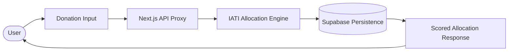

# Ihsan Labs — Waqf & Charity Intelligence Engine

> **Excellence in action. Ethical intelligence.**  
> The intelligent engine for philanthropy — evidence-guided giving for Muslims worldwide.

Ihsan Labs helps donors allocate sadaqah and waqf to the highest-impact opportunities, backed by IATI (International Aid Transparency Initiative) open aid data. Using ethical AI, the system generates scored, cited allocation plans based on factual donor intentions.

---

## 🛠 Tech Stack

* **Frontend**: Next.js 15 (App Router)
* **Language**: TypeScript
* **Package Manager**: pnpm (Workspaces)
* **Database & Auth**: Supabase (Postgres + pgvector)
* **Backend Logic**: Supabase Edge Functions (Deno)
* **Deployment**: Vercel (Web) & Supabase (Functions)
* **Integration**: Stripe (Payments), IATI (Aid Data)

---

## 📂 Repository Structure

```text
apps/
  web/                  # Next.js 15 application (Frontend)
    app/
      api/              # API routes (Proxies to Edge Functions)
supabase/
  functions/            # LLM-powered Edge Functions (Anthropic/OpenAI)
  migrations/           # SQL schema v1.1.0 + IATI ETL views
scripts/                # IATI ETL orchestrators and seeding scripts
public/                 # Global static assets (in apps/web/public)
```

| Directory | Purpose |
| :--- | :--- |
| `apps/web` | The main Next.js SPA including donor forms and resonance previews. |
| `supabase/functions` | Core intelligence engine (Allocation, Due Diligence, Agents). |
| `supabase/migrations` | Database schema, IATI tables, and performance SQL views. |
| `scripts` | Python and Shell scripts for IATI data ingestion and entity resolution. |

---

## 🚀 Local Development

Follow these steps to get the environment running locally:

```bash
# 1. Install dependencies
pnpm install

# 2. Copy environment variables
cp .env.example .env

# 3. Start local Supabase instance
pnpm db:start

# 4. Apply database schema and migrations
pnpm db:push

# 5. Seed project data and IATI records
pnpm seed
bash scripts/ingest-iati.sh --limit 100

# 6. Run the development server
pnpm dev
```

---

## 🔑 Environment Variables

Documented in `.env.example`. Ensure the following are set before starting:

| Variable | Description |
| :--- | :--- |
| `NEXT_PUBLIC_SUPABASE_URL` | Your Supabase project URL. |
| `NEXT_PUBLIC_SUPABASE_ANON_KEY` | Public key for browser-side Supabase client. |
| `SUPABASE_SERVICE_ROLE_KEY` | Secret key for server-side API routes (Admin access). |
| `DATABASE_URL` | Direct Postgres connection string for migrations. |
| `ANTHROPIC_API_KEY` | Used by Edge Functions for allocation logic (Claude 3.5). |
| `OPENAI_API_KEY` | Used for generating text embeddings (text-embedding-3-small). |
| `IATI_API_KEY` | Exchange rate normalization key for IATI data. |
| `STRIPE_SECRET_KEY` | Stripe secret for processing donations. |

---

## 🖥 Running the Application

Running `pnpm dev` starts the Next.js development server.

* **Local URL**: `http://localhost:3000`
* **Frontend**: Responsive donor dashboard and donation intention form.
* **API Routes**: Available at `/api/allocate`, `/api/donations`, and `/api/metrics`.

> [!NOTE]
> Next.js API routes act as a secure proxy to Supabase Edge Functions, ensuring LLM secrets are never exposed to the client.

---

## 🚢 Deployment

The application is optimized for deployment via **Vercel**.

### Preview Deployment
Every branch push triggers a Vercel preview deployment automatically.

### Production Deployment
```bash
# Deploy to production
vercel --prod
```

### Edge Functions
Deploy logic updates to Supabase:
```bash
pnpm deploy:functions
```

---

## 🔄 Core Workflow

The system follows a high-integrity path from donor intention to impact:



1. **Intention**: User specifies donation goals (e.g., "Water projects in East Africa").
2. **Analysis**: System queries IATI data through SQL views (`v_expense_ratios`).
3. **Allocation**: LLM generates a scored plan with cited evidence.
4. **Persistence**: Plan and intentions are stored in an immutable audit log.
5. **Response**: User receives a detailed transparency report and resonance preview.

---

## 📜 Principles

1. **IATI-First**: Factual metrics always supersede LLM hallucinations.
2. **Immutable Audit**: All modifications are appended, never updated.
3. **Privacy by Design**: Personal data is isolated; intention processing is anonymized.
